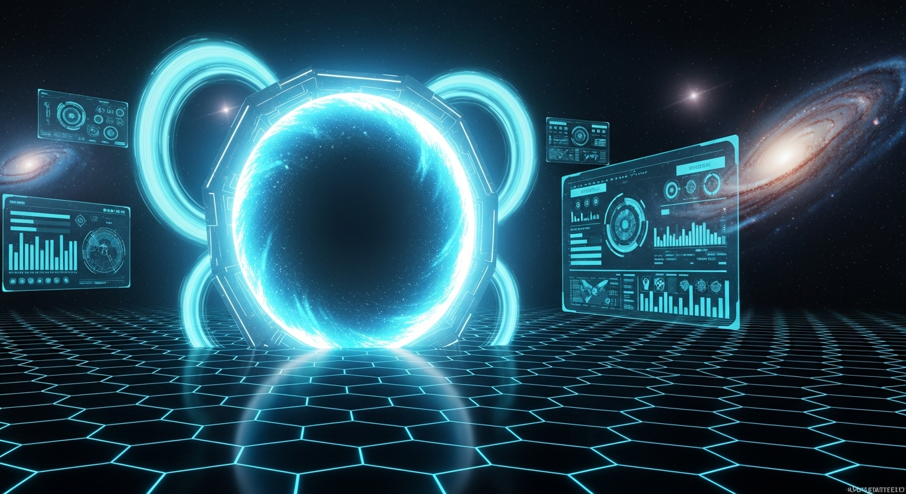
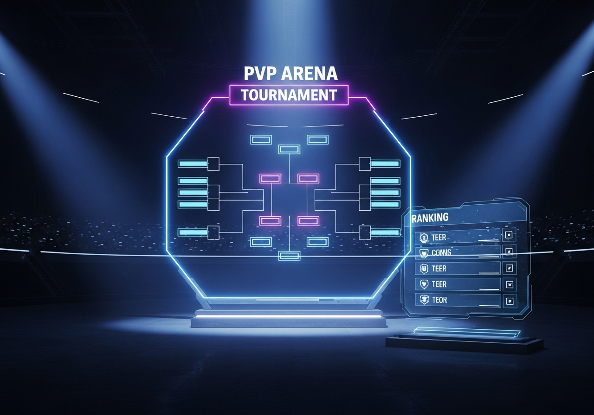
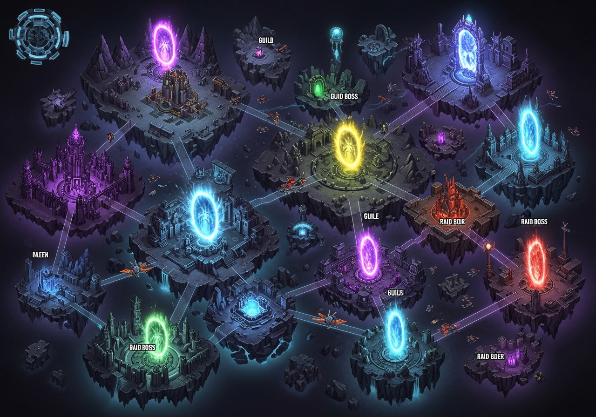

<div align="center">



<br/>
<br/>


<br/>
<br/>

> **Cổng vào chính của toàn bộ Universe Ecosystem**
> *Identity · Wallet · Inventory · Marketplace · Game · PvP · Tournament*

<br/>

[](https://nodejs.org)
[](https://typescriptlang.org)
[](https://react.dev)
[](https://orm.drizzle.team)
[](https://vite.dev)
[](https://pnpm.io)
[](https://expressjs.com)
[](https://tailwindcss.com)

<br/>


</div>

---

## 🌐 Tổng Quan

**Universe Hub** là nền tảng metaverse toàn diện — một **pnpm monorepo** tích hợp đầy đủ từ hệ thống tài khoản, ví điện tử, cho đến các module game phức tạp như PvP Arena, Guild Wars, Dungeon Raids và Tournament Brackets. Tất cả được xây dựng với TypeScript end-to-end, PostgreSQL/Drizzle ORM và React 19.

<br/>

---

## 🗺️ Kiến Trúc Tổng Thể

```
┌───────────────────────────────────────────────────────────────────────────┐
│                           UNIVERSE ECOSYSTEM                              │
│                                                                           │
│   ╔═══════════════════╗        ╔═══════════════════════════════════╗      │
│   ║  FRONTEND (5000)  ║        ║       API SERVER (8080)           ║      │
│   ║                   ║        ║                                   ║      │
│   ║  React 19 + Vite  ║◄──────►║  Express 5 + WebSocket           ║      │
│   ║  Tailwind CSS 4   ║  REST  ║  ┌──────────┐ ┌───────────────┐  ║      │
│   ║  Shadcn UI        ║  /ws   ║  │Controllers│ │   Services    │  ║      │
│   ║  Wouter Router    ║        ║  └──────────┘ └───────────────┘  ║      │
│   ╚═══════════════════╝        ║  ┌──────────┐ ┌───────────────┐  ║      │
│                                ║  │   Repos  │ │   EventBus    │  ║      │
│   ╔═══════════════════╗        ║  └──────────┘ └───────────────┘  ║      │
│   ║  Wallet  (3001)   ║        ╚═════════════════════╤═════════════╝      │
│   ║  Analytics (3002) ║                              │                    │
│   ╚═══════════════════╝              ╔═══════════════▼══════════════╗     │
│                                      ║   PostgreSQL + Drizzle ORM   ║     │
│                                      ╚══════════════════════════════╝     │
└───────────────────────────────────────────────────────────────────────────┘
```

---

## 📦 Cấu Trúc Monorepo

```
📁 universe-hub/
├── 📁 artifacts/
│   ├── 🖥️  api-server/           ← Express 5 backend (port 8080)
│   │   └── 📁 src/
│   │       ├── 📁 controllers/   ← HTTP request handlers
│   │       ├── 📁 services/      ← Business logic
│   │       ├── 📁 repositories/  ← Data access layer
│   │       ├── 📁 routes/        ← Express routers
│   │       ├── 📁 models/        ← Domain models
│   │       └── 📄 container.ts   ← Dependency injection
│   ├── 🌐 universe-hub/          ← Main React frontend (port 5000)
│   ├── 💳 wallet-app/            ← Wallet micro-app (port 3001)
│   └── 📊 ecosystem-analytics/   ← Analytics dashboard (port 3002)
├── 📁 lib/
│   ├── 🗃️  db/src/schema/        ← Drizzle schema (source of truth)
│   └── 📡 api-spec/              ← OpenAPI spec + Orval codegen
└── 📄 pnpm-workspace.yaml
```

---

## 🎮 23 HUB Modules

<table>
<thead>
<tr>
<th align="center">Module</th>
<th>Mô tả</th>
<th align="center">DB Tables</th>
<th>API</th>
</tr>
</thead>
<tbody>
<tr><td align="center">🔐 <b>HUB-1</b></td><td>Account Bridge — SSO &amp; identity token bridge</td><td align="center">—</td><td><code>/api/account</code></td></tr>
<tr><td align="center">🗂️ <b>HUB-2</b></td><td>App Registry — ecosystem app discovery</td><td align="center">3</td><td><code>/api/apps</code></td></tr>
<tr><td align="center">🚀 <b>HUB-3</b></td><td>App Launcher — SSO launch, history, favorites</td><td align="center">3</td><td><code>/api/launcher</code></td></tr>
<tr><td align="center">👤 <b>HUB-4</b></td><td>Profile &amp; Wallet — Credits / XU / Token</td><td align="center">5</td><td><code>/api/profile</code> <code>/api/wallet</code></td></tr>
<tr><td align="center">📋 <b>HUB-5</b></td><td>Application Registry — user-scoped subscriptions</td><td align="center">4</td><td><code>/api/registry</code></td></tr>
<tr><td align="center">🏪 <b>HUB-6</b></td><td>Marketplace — listings, auctions, bids, watchlists</td><td align="center">12</td><td><code>/api/marketplace</code></td></tr>
<tr><td align="center">🎒 <b>HUB-7</b></td><td>Inventory — items across all ecosystem apps</td><td align="center">4</td><td><code>/api/inventory</code></td></tr>
<tr><td align="center">🔔 <b>HUB-8</b></td><td>Notifications — realtime push &amp; notification center</td><td align="center">3</td><td><code>/api/notifications</code></td></tr>
<tr><td align="center">⭐ <b>HUB-9</b></td><td>Reputation — XP, achievements, rank tiers</td><td align="center">4</td><td><code>/api/reputation</code></td></tr>
<tr><td align="center">📊 <b>HUB-10</b></td><td>Analytics — platform-wide analytics dashboard</td><td align="center">6</td><td><code>/api/analytics</code></td></tr>
<tr><td align="center">⚔️ <b>HUB-11</b></td><td>Guild System — guilds, roles, treasury, wars</td><td align="center">11</td><td><code>/api/guilds</code></td></tr>
<tr><td align="center">📜 <b>HUB-12</b></td><td>Quest System — daily/weekly quests &amp; objectives</td><td align="center">8</td><td><code>/api/quests</code></td></tr>
<tr><td align="center">✉️ <b>HUB-13</b></td><td>Mail System — in-game mailbox &amp; attachments</td><td align="center">4</td><td><code>/api/mail</code></td></tr>
<tr><td align="center">💬 <b>HUB-14</b></td><td>Chat System — channels, DMs, realtime messaging</td><td align="center">7</td><td><code>/api/chat</code></td></tr>
<tr><td align="center">🌍 <b>HUB-15</b></td><td>World System — zones, regions, world events</td><td align="center">11</td><td><code>/api/worlds</code></td></tr>
<tr><td align="center">🤖 <b>HUB-16</b></td><td>AI System — Nova AI companion &amp; conversations</td><td align="center">5</td><td><code>/api/ai</code></td></tr>
<tr><td align="center">🔨 <b>HUB-17</b></td><td>Crafting &amp; Economy — crafting, resources, NPC shops</td><td align="center">14</td><td><code>/api/crafting</code> <code>/api/economy</code></td></tr>
<tr><td align="center">🧙 <b>HUB-18</b></td><td>Character System — classes, skills, progression</td><td align="center">12</td><td><code>/api/characters</code></td></tr>
<tr><td align="center">⚔️ <b>HUB-19</b></td><td>Combat System — turn-based battles, loot</td><td align="center">15</td><td><code>/api/combat</code></td></tr>
<tr><td align="center">🐾 <b>HUB-20</b></td><td>Pet &amp; Mount System — companions, mounts, breeding</td><td align="center">20</td><td><code>/api/pets</code> <code>/api/mounts</code></td></tr>
<tr><td align="center">🏰 <b>HUB-21</b></td><td>Dungeon &amp; Raid — 5 dungeons, 4 raid bosses</td><td align="center">19</td><td><code>/api/dungeons</code> <code>/api/raids</code></td></tr>
<tr><td align="center">👾 <b>HUB-22</b></td><td>Boss AI &amp; World Events — dynamic bosses, weather</td><td align="center">20</td><td><code>/api/bosses</code> <code>/api/world-events</code></td></tr>
<tr><td align="center">🏆 <b>HUB-23</b></td><td>PvP Arena &amp; Tournament — MMR, ranked seasons, brackets</td><td align="center">18</td><td><code>/api/pvp</code> <code>/api/tournaments</code></td></tr>
</tbody>
</table>

<div align="center">


</div>

---

## 🖼️ Screenshots

<table>
<tr>
<td width="50%" align="center">

### 🏆 PvP Arena & Tournament



*Ranked Matchmaking · MMR System · Season Brackets*

</td>
<td width="50%" align="center">

### 💰 Economy & Wallet


*Credits · XU Tokens · Transaction History*

</td>
</tr>
<tr>
<td colspan="2" align="center">

### 🌍 World & Game Systems



*Guilds · Dungeons · Raid Bosses · World Events*

</td>
</tr>
</table>

---

## ⚙️ Tech Stack

<table>
<tr>
<th align="center">🖥️ Frontend</th>
<th align="center">⚙️ Backend</th>
<th align="center">🗃️ Data & Infra</th>
</tr>
<tr>
<td>

- **React 19** — UI framework
- **Vite 7** — build & dev server
- **Tailwind CSS 4** — utility-first styling
- **Shadcn UI** — component library
- **Wouter** — lightweight routing
- **TanStack Query** — server state
- **Lucide React** — icon system

</td>
<td>

- **Express 5** — HTTP server
- **Node.js 20** — runtime
- **TypeScript 5.9** — type safety
- **Drizzle ORM** — type-safe queries
- **Zod v4** — schema validation
- **ws** — WebSockets
- **Pino** — structured logging

</td>
<td>

- **PostgreSQL** — primary database
- **Drizzle Kit** — schema migrations
- **Orval** — API client codegen
- **OpenAPI 3.0** — API specification
- **esbuild** — production bundler
- **pnpm** — package management

</td>
</tr>
</table>

---

## 🚀 Khởi Động Dự Án

### Yêu Cầu

| | Phần mềm | Phiên bản |
|--|----------|-----------|
| ⚙️ | Node.js | 20+ |
| 📦 | pnpm | 9+ |
| 🗃️ | PostgreSQL | 14+ |

### Cài Đặt

```bash
# 1. Cài dependencies
pnpm install

# 2. Đẩy schema lên database
pnpm --filter @workspace/db run push

# 3. Khởi động API server (port 8080)
pnpm --filter @workspace/api-server run dev

# 4. Khởi động frontend (port 5000)
pnpm --filter @workspace/universe-hub run dev
```

### Biến Môi Trường

| Biến | Bắt buộc | Mô tả |
|------|:--------:|-------|
| `DATABASE_URL` | ✅ | PostgreSQL connection string |
| `SUPABASE_URL` | ⬜ | Supabase endpoint (tùy chọn) |
| `SUPABASE_ANON_KEY` | ⬜ | Supabase anon key (tùy chọn) |

> 💡 Nếu không có Supabase, hệ thống tự động fallback về InMemory repositories — app vẫn chạy bình thường.

---

## 🗃️ Database & Repository Pattern

```
                    container.ts
                         │
              isSupabaseConfigured()?
                    ╱         ╲
                 YES            NO
                  │              │
          SupabaseRepo      InMemoryRepo
               │
         FallbackRepo (Supabase → InMemory)
```

Schema tập trung tại `lib/db/src/schema/`, mỗi module có file riêng:

| File | Module | Tables |
|------|--------|-------:|
| `index.ts` | Core (marketplace, inventory, notifications…) | 30+ |
| `guild.ts` | HUB-11 Guild System | 11 |
| `quest.ts` | HUB-12 Quest System | 8 |
| `chat.ts` | HUB-14 Chat System | 7 |
| `world.ts` | HUB-15 World System | 11 |
| `crafting.ts` | HUB-17 Crafting & Economy | 14 |
| `character.ts` | HUB-18 Character System | 12 |
| `combat.ts` | HUB-19 Combat System | 15 |
| `pets.ts` | HUB-20 Pet & Mount System | 20 |
| `dungeon.ts` | HUB-21 Dungeon & Raid | 19 |
| `boss.ts` | HUB-22 Boss AI & World Events | 20 |
| `pvp.ts` | HUB-23 PvP Arena & Tournament | 18 |

---

## 📡 WebSocket Realtime Events

| Event | Mô tả |
|-------|-------|
| `listing:created` | Listing mới xuất hiện trên marketplace |
| `auction:bid` | Có bid mới trên auction |
| `auction:ended` | Auction kết thúc, winner xác định |
| `pvp:match_started` | Trận đấu PvP Arena bắt đầu |
| `pvp:match_ended` | Trận đấu PvP kết thúc, MMR cập nhật |
| `world:event_started` | World event được kích hoạt |
| `boss:spawned` | Boss mới xuất hiện trong thế giới |
| `weather:changed` | Thời tiết thay đổi |

---

## 🛠️ Các Lệnh Thường Dùng

```bash
# Typecheck toàn bộ project
pnpm run typecheck

# Build tất cả packages
pnpm run build

# Tái tạo API hooks từ OpenAPI spec
pnpm --filter @workspace/api-spec run codegen

# Đẩy thay đổi schema DB
pnpm --filter @workspace/db run push

# Chạy Wallet App (port 3001)
PORT=3001 pnpm --filter @workspace/wallet-app run dev

# Chạy Ecosystem Analytics (port 3002)
PORT=3002 pnpm --filter @workspace/ecosystem-analytics run dev
```

---

## 🏗️ Dependency Injection — Thứ Tự Boot

```
container.ts bootstraps theo thứ tự:

  [1] Core          DB → Notifications → Activities → Reputation → Achievements
  [2] Marketplace   Listings → Auctions → Bids → Watchlists → Analytics
  [3] Social        App Registry → Launcher → Social Graph
  [4] Game Core     Guild → Quest → Mail → Chat → World → AI
  [5] Economy       Crafting → Resources → NPC Shops
  [6] RPG           Character → Combat → Pets → Mounts
  [7] Endgame       Dungeons → Raids → Bosses → World Events → Weather
  [8] Competitive   PvP → Ranking → Tournament → Matchmaking
```

---

## 🎯 Kiến Trúc Quyết Định

| Quyết định | Lý do |
|-----------|-------|
| **Dual-repo pattern** | Chạy được cả khi không có Supabase (dev/test không cần credentials) |
| **Registry-first launcher** | Chỉ app hợp lệ mới được launch với SSO token |
| **No local auth** | Identity do Universe Account quản lý (AccountBridge) |
| **In-memory event bus** | Đơn giản cho dev — thay bằng Redis Pub/Sub cho production |
| **OpenAPI → Orval codegen** | API contract là source of truth, frontend luôn type-safe |
| **esbuild bundle** | Build nhanh hơn tsc; CJS output tương thích Node.js 20 |
| **SEED_APPS pattern** | `appRegistryService.ts` là nơi duy nhất đăng ký app mới |

---

## ⚠️ Lưu Ý Kỹ Thuật

> [!NOTE]
> **Pre-existing typecheck errors** trong `marketplaceSavedSearch.test.ts`, `marketplaceSearch.test.ts`, `marketplaceReputationController.ts` — không sửa trừ khi được yêu cầu cụ thể.

> [!TIP]
> **Vite proxy** tự động forward: `/api/*` → `localhost:8080` và `/ws/*` → `ws://localhost:8080` — không cần config CORS riêng trong dev.

> [!IMPORTANT]
> **`userReputationRepo`** (không phải `userReputationService`) phải được truyền vào CraftingService, ResourceService, NPCShopService và các service cần reputation.

---

<div align="center">

<br/>


```
  ╔══════════════════════════════════════════════════╗
  ║         SYSTEM v4.7.2  //  UNIVERSE HUB          ║
  ║   23 Modules · 200+ Tables · 300+ API Endpoints  ║
  ║              Built for the Metaverse             ║
  ╚══════════════════════════════════════════════════╝
```

*Made with ❤️ — Universe Ecosystem*

</div>
